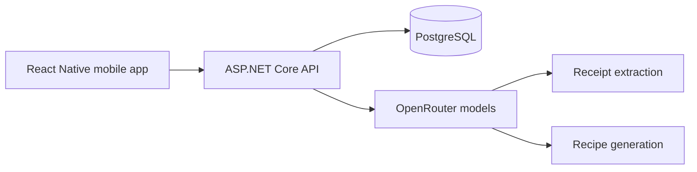

# Mealer

> **Plan meals. Waste less. Spend smarter.**

Mealer is a full-stack mobile meal-planning prototype that connects grocery
receipt scanning, pantry tracking, AI-generated recipes, prepared-meal portions,
weekly planning, and spending insights.

The project was created for the ICON Lyra Hackathon and is currently an active
prototype.

## What Mealer does

- Scans grocery receipts with a vision model.
- Lets users review extracted items, quantities, units, and prices before saving.
- Tracks pantry contents and the estimated value of food on hand.
- Generates recipes grounded in the user's pantry and prioritises food expiring
  soon.
- Shows recipe ingredient matches, preparation time, and cost per serving.
- Records cooked batches and their remaining portions.
- Supports tap or drag-and-drop meal scheduling across a weekly calendar.
- Reduces the available portion count when a meal is planned.
- Visualises grocery spending by day, week, or month and keeps weekly
  receipt/prepared-meal history.
- Provides authenticated, user-scoped data through a C# API.

## Tech stack

| Layer | Technology |
|---|---|
| Mobile | React Native, Expo 52, Expo Router, TypeScript |
| UI | NativeWind, Tailwind CSS, Expo Ionicons |
| Backend | ASP.NET Core, C#, .NET 10 |
| Data access | Entity Framework Core, Npgsql |
| Database | PostgreSQL 16 |
| AI | OpenRouter language and vision models with structured tool output |
| Authentication | JWT bearer authentication |
| Local infrastructure | Docker Compose |

## Architecture



The AI layer proposes structured data. The C# backend remains responsible for
authentication, validation, calculations, and database writes.

## UI design system

Mealer follows the approved visual direction with a warm cream canvas, white
cards, near-black typography, a green primary accent, and orange/red attention
states. The current frontend follows the **Minimal utility badge** system:

- neutral badges for metadata and provenance;
- green badges for ready or positive states;
- accent badges for AI and selected-plan information;
- small Ionicons paired with labels for accessibility;
- no more than two or three badges on a normal card.

The system is implemented through the reusable `Badge` component in
`prototype/mobile/components/ui.tsx` and is used across Pantry, Recipes, Plan,
and Budget.

The Budget tab is backed by `GET /api/Spending/trend`, which returns timezone-
adjusted, zero-filled day/week/month buckets plus current-versus-previous period
totals. The chart therefore renders verified backend calculations rather than
performing financial aggregation in the mobile client.

## Project structure

```text
.
├── docs/                         Product and engineering documentation
├── prototype/
│   ├── mobile/                   React Native Expo application
│   │   ├── app/                  Expo Router screens
│   │   ├── components/           Shared UI and feature components
│   │   ├── lib/                  Authentication, dates, storage, and theme
│   │   └── services/             Typed API client
│   ├── backend/
│   │   └── FridgeMealPlanner/    ASP.NET Core application
│   │       ├── Controllers/      HTTP endpoints
│   │       ├── Data/             Entity Framework database context
│   │       ├── Models/           Relational entities
│   │       ├── Services/         AI, OCR, auth, costs, and unit logic
│   │       └── Migrations/       PostgreSQL migrations
│   └── database/                 PostgreSQL Docker Compose configuration
└── scripts/                      Documentation generation utilities
```

## Run locally

### Requirements

- Docker with Docker Compose
- .NET 10 SDK
- Node.js and npm
- An OpenRouter API key for receipt scanning and AI recipe generation

### 1. Start PostgreSQL

```bash
cd prototype/database
docker compose up -d
```

The development database listens on port `5436`.

### 2. Start the backend

```bash
cd prototype/backend/FridgeMealPlanner
export OPENROUTER_API_KEY="your-key"
export JWT_SECRET="replace-with-a-long-random-secret"
dotnet run
```

The API starts at `http://localhost:5097`, applies pending migrations, and
provides Swagger UI at `http://localhost:5097/swagger`.

Optional AI model configuration:

```bash
export OPENROUTER_MODEL="openai/gpt-4o-mini"
export OPENROUTER_VISION_MODEL="openai/gpt-4o"
```

### 3. Start the mobile app

```bash
cd prototype/mobile
npm ci
export EXPO_PUBLIC_API_URL="http://localhost:5097"
npm start
```

For a physical phone, set `EXPO_PUBLIC_API_URL` to the computer's local network
address instead of `localhost`.

## Verification

### Mobile

```bash
cd prototype/mobile
npm run ts:check
npx expo export --platform web
```

### Backend

```bash
cd prototype/backend/FridgeMealPlanner
dotnet build
```

## Documentation

The documentation distinguishes implemented prototype behaviour from planned
product work.

| Document | Purpose |
|---|---|
| [Product and build plan](docs/PRODUCT_AND_BUILD_PLAN.md) | Product scope, MVP, phases, and acceptance criteria |
| [Tech stack and architecture](docs/TECH_STACK_AND_ARCHITECTURE.md) | Mobile, C# backend, PostgreSQL, AI, and deployment decisions |
| [User flows](docs/USER_FLOWS.md) | Onboarding, receipt, pantry, recipe, planning, and shopping flows |
| [Backend, AI, and API](docs/BACKEND_AI_AND_API.md) | Service boundaries, validation, AI tools, and endpoints |
| [Data schema](docs/DATA_SCHEMA.md) | Implementation-aligned relational graph and data constraints |
| [Implementation audit](docs/IMPLEMENTATION_AUDIT.md) | Current capability map, gaps, and prioritised fixes |
| [AI-assisted grocery route plan](docs/SHOPPING_ROUTE_FEATURE_PLAN.md) | Store discovery and route optimisation without a stock-availability layer |
| [Project documentation](docs/PROJECT_DOCUMENTATION.docx) | Editable Word version of the project handbook |

## Planned next steps

- AI-generated weekly meal-plan proposals with user review and editing.
- Reliable shopping-list generation with complete unit conversion.
- Fastest and easiest shopping-route recommendations for selected stores.
- Expiry reminders and proactive suggestions.
- Shared household pantries and collaborative planning.
- Nutrition goals and deeper spending insights.

## Repository

[github.com/Zackkzz/icon_lyra_hackathon](https://github.com/Zackkzz/icon_lyra_hackathon)
