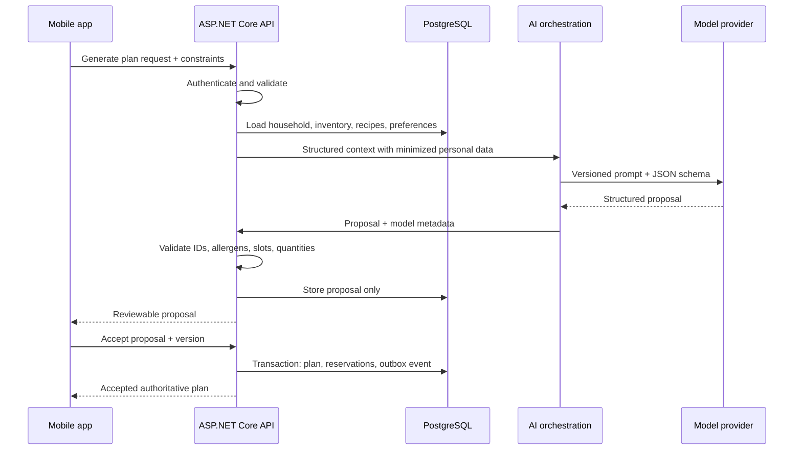

# Backend, AI, and API

## Responsibility boundary

The ASP.NET Core backend is the only component allowed to authorize users,
validate commands, calculate authoritative quantities, and commit PostgreSQL
transactions. Mobile input, OCR output, and model output are untrusted data.

## Current API surface

Controller routes use ASP.NET's `[Route("api/[controller]")]` convention.

| Method | Implemented route | Purpose |
|---|---|---|
| `GET` | `/api/fridge` | List fridge items with ingredient details |
| `POST` | `/api/fridge` | Add or merge stock by ingredient and unit |
| `PATCH` | `/api/fridge/{id}/use?quantity=` | Deduct stock and delete an empty row |
| `DELETE` | `/api/fridge/{id}` | Delete a fridge row |
| `GET` | `/api/recipes` | List recipe summaries |
| `GET` | `/api/recipes/{id}` | Get recipe and requirements |
| `GET` | `/api/recipes/suggest?ingredients=1,2` | Rank recipes by matched ingredient IDs |
| `GET` | `/api/mealplan?week=YYYY-MM-DD` | Read seven days of meal entries |
| `POST` | `/api/mealplan` | Create a meal entry |
| `PUT` | `/api/mealplan/{id}` | Replace a meal entry |
| `DELETE` | `/api/mealplan/{id}` | Delete a meal entry |
| `POST` | `/api/shoppinglist/generate?week=&userId=` | Generate and store a shopping list |
| `GET` | `/api/conversions` | List unit conversion records |
| `GET` | `/api/conversions/convert` | Convert a quantity |
| `POST` | `/api/chat` | Run stateless AI chat with backend tools |

Route matching is normally case-insensitive, but punctuation is significant.
The mobile client currently calls `/api/shopping-list/generate`, while the
controller convention produces `/api/shoppinglist/generate`.

## Current AI tools

| Tool | Access | Database effect |
|---|---|---|
| `get_fridge_contents` | Read | None |
| `get_expiring_soon` | Read | None |
| `suggest_recipes` | Read | None |
| `generate_meal_plan` | Write | Inserts `MealPlans` directly |
| `create_shopping_list` | Write | Inserts `ShoppingLists` and items |
| `use_ingredient` | Write | Updates or deletes `FridgeItems` |
| `add_ingredient` | Write | May insert `Ingredients`; inserts/updates `FridgeItems` |

OpenRouter returns tool calls to `OpenRouterService`; `ToolExecutor` dispatches
them against EF Core. The current request contains only a system prompt and the
latest user message, so conversations do not retain history.

## Target AI request lifecycle

## Required verification rules

- Authenticate every user and derive the user/household from the token, not a
  request `UserId` string.
- Confirm membership and role for every aggregate read/write.
- Reject unknown ingredient, recipe, inventory, proposal, and plan IDs.
- Validate enum values, dates, positive quantities, serving counts, and units.
- Check allergen exclusions deterministically after model generation.
- Re-read inventory and verify proposal version inside the acceptance
  transaction.
- Make retryable writes idempotent.
- Keep AI suggestions separate from authoritative tables until acceptance.
- Store prompt/model/schema versions and validation failures without retaining
  unnecessary sensitive content.

## Target API groups

- `/api/v1/households` and `/members`
- `/api/v1/ingredients`, `/products`, and `/recipes`
- `/api/v1/receipts`, `/lines`, `/confirm`
- `/api/v1/inventory/lots` and `/events`
- `/api/v1/plan-proposals`, `/accept`, and `/meal-plans`
- `/api/v1/prepared-meals`
- `/api/v1/shopping-lists` and `/items/{id}`
- `/api/v1/assistant/messages` for optional persisted conversations

Use OpenAPI-generated TypeScript types/client code so React Native contracts do
not drift from C# DTOs.

## Reliability and security

- Transactions for receipt confirmation, proposal acceptance, inventory use,
  and shopping-list replacement.
- Optimistic concurrency tokens for inventory and plans.
- Outbox events for asynchronous notifications and regeneration work.
- Bounded model/tool loops, timeouts, cancellation tokens, and provider retries.
- Rate limits and size limits for chat and uploads.
- Signed object-storage URLs, malware/type checks, retention policies, and
  redaction of receipt payment identifiers.
- Structured logs with correlation IDs; never log API keys or raw authorization
  headers.

