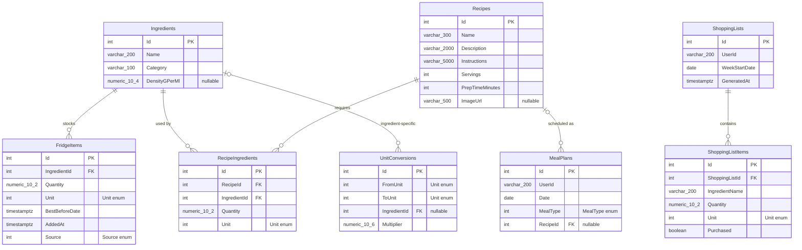

# Fridge Meal Planner — Implemented Data Schema

**Status:** implementation-aligned  
**Database:** PostgreSQL 16  
**ORM:** Entity Framework Core with Npgsql  
**Backend:** ASP.NET Core / C# (`net10.0`)  
**Reviewed:** 22 July 2026

This document describes the schema that is implemented in
`prototype/backend/FridgeMealPlanner`. It is derived from the EF Core models,
`AppDbContext`, the `InitialCreate` migration, controllers, AI tool executor,
and the React Native API contract. It intentionally does not describe the
larger proposed architecture unless a feature is clearly marked as not yet
persisted.

## Relational graph

`RecipeIngredients` is the many-to-many bridge between `Recipes` and
`Ingredients`. The other implemented relationships are one-to-many. A
`MealPlan` may have no recipe, and a generic `UnitConversion` has no ingredient.

## Tables

### `Ingredients`

Canonical ingredient catalogue used by fridge stock, recipes, conversions,
recipe matching, and shopping-list generation.

| Column | PostgreSQL type | Null | Constraints / behaviour |
|---|---|---:|---|
| `Id` | `integer` | No | Primary key; identity by default |
| `Name` | `varchar(200)` | No | Required |
| `Category` | `varchar(100)` | No | Defaults to an empty string in C# for new model instances |
| `DensityGPerMl` | `numeric(10,4)` | Yes | Optional density metadata |

The migration seeds 15 ingredients. There is no unique index on `Name`, so the
database can contain duplicates even though the AI add-ingredient tool performs
a case-insensitive lookup first.

### `FridgeItems`

Current fridge stock. The application generally treats one row as the
aggregate quantity for an ingredient/unit pair.

| Column | PostgreSQL type | Null | Constraints / behaviour |
|---|---|---:|---|
| `Id` | `integer` | No | Primary key; identity by default |
| `IngredientId` | `integer` | No | FK → `Ingredients.Id` |
| `Quantity` | `numeric(10,2)` | No | Increased when the same ingredient/unit is added |
| `Unit` | `integer` | No | `Unit` enum |
| `BestBeforeDate` | `timestamp with time zone` | No | Used by expiry sorting and priority badges |
| `AddedAt` | `timestamp with time zone` | No | Set to UTC by application code |
| `Source` | `integer` | No | `Source` enum |

Deleting an ingredient cascades to its fridge items. An index exists on
`IngredientId`. There is no database uniqueness constraint on
`(IngredientId, Unit)`, although the controller and AI tool assume at most one
matching row. There are also no database checks preventing zero or negative
quantities.

### `Recipes`

Recipe metadata and cooking instructions.

| Column | PostgreSQL type | Null | Constraints / behaviour |
|---|---|---:|---|
| `Id` | `integer` | No | Primary key; identity by default |
| `Name` | `varchar(300)` | No | Required |
| `Description` | `varchar(2000)` | No | Required by generated schema |
| `Instructions` | `varchar(5000)` | No | Required by generated schema |
| `Servings` | `integer` | No | No positive-value check |
| `PrepTimeMinutes` | `integer` | No | No non-negative check |
| `ImageUrl` | `varchar(500)` | Yes | Optional image URL |

The migration seeds five recipes.

### `RecipeIngredients`

Ingredient requirements for a recipe. This is the implemented recipe-to-
ingredient join table and stores the required amount.

| Column | PostgreSQL type | Null | Constraints / behaviour |
|---|---|---:|---|
| `Id` | `integer` | No | Primary key; identity by default |
| `RecipeId` | `integer` | No | FK → `Recipes.Id` |
| `IngredientId` | `integer` | No | FK → `Ingredients.Id` |
| `Quantity` | `numeric(10,2)` | No | Required amount per stored recipe |
| `Unit` | `integer` | No | `Unit` enum |

Both foreign keys cascade on delete. Separate indexes exist on `RecipeId` and
`IngredientId`. There is no unique constraint on `(RecipeId, IngredientId)`, so
the same ingredient may be repeated within a recipe. The migration seeds 23
requirements for the five sample recipes.

### `MealPlans`

One scheduled meal entry. The mobile planner creates a row for a date, meal
type, user string, and optional recipe.

| Column | PostgreSQL type | Null | Constraints / behaviour |
|---|---|---:|---|
| `Id` | `integer` | No | Primary key; identity by default |
| `UserId` | `varchar(200)` | No | Plain string; not an FK to an identity table |
| `Date` | `date` | No | Calendar date |
| `MealType` | `integer` | No | `MealType` enum |
| `RecipeId` | `integer` | Yes | FK → `Recipes.Id` |

Deleting a recipe sets `RecipeId` to null. An index exists on `RecipeId`.
There is no unique constraint on `(UserId, Date, MealType)`, so repeated taps or
AI runs can create multiple meals in the same slot. The week GET endpoint does
not filter by `UserId`, while shopping-list generation does.

### `ShoppingLists`

Header for a generated weekly shopping list.

| Column | PostgreSQL type | Null | Constraints / behaviour |
|---|---|---:|---|
| `Id` | `integer` | No | Primary key; identity by default |
| `UserId` | `varchar(200)` | No | Plain string; not an FK |
| `WeekStartDate` | `date` | No | Start of requested seven-day range |
| `GeneratedAt` | `timestamp with time zone` | No | Set to UTC by application code |

Every generation creates a new list. There is no unique constraint or status
field for choosing the active list for a user/week.

### `ShoppingListItems`

Materialized missing quantities calculated from planned recipes minus fridge
stock. The ingredient is stored as display text rather than a foreign key.

| Column | PostgreSQL type | Null | Constraints / behaviour |
|---|---|---:|---|
| `Id` | `integer` | No | Primary key; identity by default |
| `ShoppingListId` | `integer` | No | FK → `ShoppingLists.Id` |
| `IngredientName` | `varchar(200)` | No | Denormalized ingredient name |
| `Quantity` | `numeric(10,2)` | No | Calculated missing quantity |
| `Unit` | `integer` | No | `Unit` enum |
| `Purchased` | `boolean` | No | Defaults to `false` in C# |

Deleting a shopping list cascades to its items. An index exists on
`ShoppingListId`. The current mobile checkbox changes local React state only;
there is no endpoint that persists `Purchased` changes.

### `UnitConversions`

Multipliers for generic and ingredient-specific unit conversion.

| Column | PostgreSQL type | Null | Constraints / behaviour |
|---|---|---:|---|
| `Id` | `integer` | No | Primary key; identity by default |
| `FromUnit` | `integer` | No | `Unit` enum |
| `ToUnit` | `integer` | No | `Unit` enum |
| `IngredientId` | `integer` | Yes | FK → `Ingredients.Id`; null means generic |
| `Multiplier` | `numeric(10,6)` | No | Result = input × multiplier |

Deleting an ingredient sets `IngredientId` to null. An index exists on
`IngredientId`. The migration seeds 20 conversions. There is no uniqueness
constraint on `(FromUnit, ToUnit, IngredientId)`.

## Enum storage

EF Core stores all three enums as PostgreSQL integers. Values are part of the
database contract and must not be reordered without a data migration.

### `Unit`

| Value | Integer |
|---|---:|
| `Grams` | 0 |
| `Ml` | 1 |
| `Pieces` | 2 |
| `Cups` | 3 |
| `Tbsp` | 4 |
| `Tsp` | 5 |

### `Source`

| Value | Integer |
|---|---:|
| `Receipt` | 0 |
| `Manual` | 1 |

### `MealType`

| Value | Integer |
|---|---:|
| `Breakfast` | 0 |
| `Lunch` | 1 |
| `Dinner` | 2 |
| `Snack` | 3 |

## Foreign keys and delete rules

| Child column | Parent column | On delete |
|---|---|---|
| `FridgeItems.IngredientId` | `Ingredients.Id` | Cascade |
| `RecipeIngredients.RecipeId` | `Recipes.Id` | Cascade |
| `RecipeIngredients.IngredientId` | `Ingredients.Id` | Cascade |
| `MealPlans.RecipeId` | `Recipes.Id` | Set null |
| `ShoppingListItems.ShoppingListId` | `ShoppingLists.Id` | Cascade |
| `UnitConversions.IngredientId` | `Ingredients.Id` | Set null |

## Implemented write flows

### Add or use fridge stock

1. The API verifies that an ingredient ID exists for normal mobile requests.
2. It looks for an existing `FridgeItems` row with the same ingredient and unit.
3. It adds the quantity and retains the later best-before date, or inserts a new
   row.
4. Using stock subtracts quantity; the row is deleted when quantity reaches
   zero or less.

The AI tool follows the same merge behaviour and can create a new `Ingredients`
row by name. These steps are application conventions, not database constraints.

### Weekly meal planning

The mobile app writes one `MealPlans` row per chosen recipe slot. The AI tool
can create breakfast, lunch, and dinner rows for a requested number of days by
randomly selecting stored recipes. AI proposals are not stored separately and
there is no accept/reject workflow.

### Shopping-list generation

1. Load the user's recipe-backed meal plans in the requested seven-day range.
2. Sum `RecipeIngredients` by ingredient ID.
3. Subtract fridge stock only when the stored unit exactly matches the recipe
   unit.
4. Insert one `ShoppingLists` row and its missing `ShoppingListItems` rows.

The generator currently stores an ingredient name snapshot, not
`IngredientId`, and does not use the available conversion table during this
calculation.

## Features not persisted in the current implementation

The following product concepts are not represented by the current EF Core
schema:

- user accounts, authentication, households, roles, and data ownership;
- receipt image uploads, OCR jobs, parsed receipt lines, and confidence/review
  state;
- distinct use-by, best-before, and estimated expiry date types;
- inventory lots, storage locations, immutable quantity events, and meal
  reservations;
- prepared-meal batches and individual portions;
- AI conversations, messages, prompts, model metadata, suggestions, proposals,
  acceptance, or feedback;
- dietary preferences, allergens, nutrition targets, recipe tags, and cost;
- durable shopping-item completion from the mobile app.

The OpenRouter chat layer is stateless: each request starts a new model
conversation, and only tool side effects—fridge items, meal plans, and shopping
lists—are written to PostgreSQL.

## Implementation risks visible in the schema

These are documentation findings; this schema file does not alter runtime code.

1. Add a unique constraint on `FridgeItems (IngredientId, Unit)` because both
   write paths assume a single row and use `FirstOrDefault`/`First`.
2. Add a unique constraint on `MealPlans (UserId, Date, MealType)` or explicitly
   support multiple entries per slot in the API and UI.
3. Add `IngredientId` to `ShoppingListItems` while retaining `IngredientName`
   only as an optional snapshot.
4. Add check constraints for positive quantities, servings, prep time, and
   conversion multipliers.
5. Make user ownership relational before supporting multiple users; currently
   fridge and recipe data are global, meal-plan reads are unscoped, and only
   some generation paths filter the plain `UserId` string.
6. Use `UnitConversions` when aggregating recipe requirements and fridge stock,
   and add a uniqueness rule for conversion keys.
7. Add a backend update endpoint if `ShoppingListItems.Purchased` should survive
   app restarts.

## Sources of truth reviewed

- `prototype/backend/FridgeMealPlanner/Data/AppDbContext.cs`
- `prototype/backend/FridgeMealPlanner/Models/*.cs`
- `prototype/backend/FridgeMealPlanner/Enums/*.cs`
- `prototype/backend/FridgeMealPlanner/Migrations/20260722044624_InitialCreate.cs`
- `prototype/backend/FridgeMealPlanner/Controllers/*.cs`
- `prototype/backend/FridgeMealPlanner/Services/ToolExecutor.cs`
- `prototype/mobile/services/api.ts`
- `prototype/mobile/app/*.tsx`

