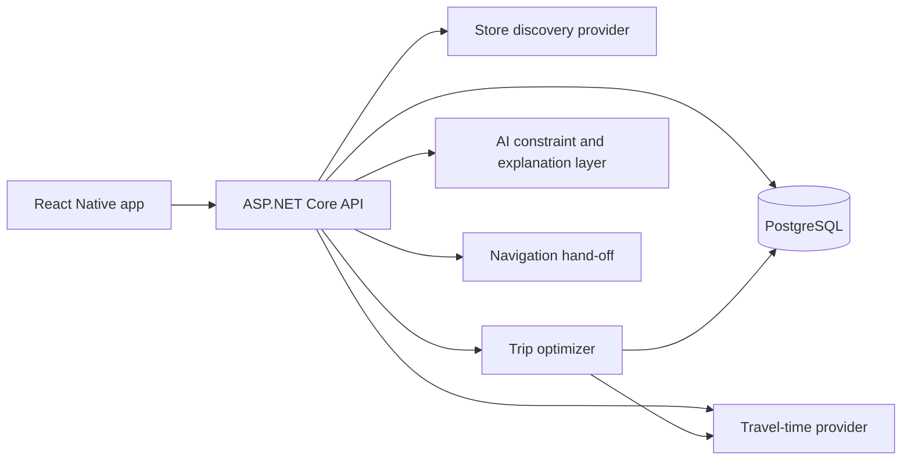

# AI-assisted grocery route — implementation plan

**Status:** proposed feature
**Backend:** ASP.NET Core / C#
**Goal:** turn an accepted meal plan and shopping list into the fastest,
lowest-effort shopping trip.

## Scope decision

Product availability and retailer inventory are explicitly out of scope. The
planner assumes that each eligible full-service supermarket can satisfy the
shopping list. It does not fetch, infer, display, or promise stock status.

The MVP optimizes travel between stores. Indoor aisle routing is also out of
scope because it requires retailer-specific store-layout data.

## Product experience

After accepting a weekly meal plan and generating its shopping list, the user
selects **Plan my shopping trip**. They confirm:

- starting point and optional final destination;
- departure time;
- driving, walking, cycling, or public-transport mode;
- preferred or excluded retailers;
- whether the trip must return home;
- maximum number of stops;
- optional mandatory stops, such as a butcher or market.

The result contains:

- recommended store or ordered stores;
- total travel time, distance, and estimated shopping time;
- alternatives labelled **Easiest**, **Fastest**, and **Balanced**;
- an explanation of the trade-offs;
- hand-off to turn-by-turn navigation.

## Important optimization consequence

Without availability, price, or user-assigned item constraints, a single store
will normally dominate a multi-store trip: every additional store adds travel
and stop overhead without satisfying a new requirement. Therefore:

- the default result is the best single full-service supermarket;
- multiple stops are generated only when the user adds mandatory stores,
  assigns categories to different store types, or explicitly requests multiple
  retailers;
- the system never invents a reason to visit an extra store.

## Define “fastest and easiest”

Do not minimize road duration alone. Use a total-effort objective:

```text
effort = travel minutes
       + estimated in-store minutes
       + parking/entry/checkout overhead per stop
       + walking/accessibility penalties
       + closing-time risk penalty
       + user preference penalties
```

| Factor | Default rule |
|---|---|
| Travel | Use departure time and predicted traffic where supported |
| Stops | Prefer one store; MVP maximum is three |
| In-store time | Estimate from shopping-list size and store-type baseline |
| Opening hours | Exclude stores closed at predicted arrival |
| Preferences | Apply preferred/excluded retailer and accessibility rules |
| Tolls | Respect the user's avoid-tolls setting |
| Stability | Prefer fewer turns and simpler routes when scores are close |

Suggested option definitions:

- **Easiest:** fewest stops, shortest walking, and simplest journey.
- **Fastest:** lowest predicted end-to-end duration.
- **Balanced:** a weighted compromise between duration, distance, complexity,
  and retailer preference.

## Responsibility boundaries

### AI layer

- Convert natural constraints such as “after class,” “walking only,” or “stop
  at the butcher first” into a typed request.
- Explain why an option was recommended.
- Translate follow-ups such as “avoid that store” into explicit constraints.
- Suggest schedule changes when stores would be closed.

### Deterministic C# backend

- Authorize the household and load the accepted shopping list.
- Discover real stores and retrieve coordinates and opening hours.
- Calculate departure-time-aware travel matrices.
- Apply mandatory-stop and retailer constraints.
- Optimize store selection and visit order.
- Persist a versioned plan and refresh stale routes.

The language model must not invent stores, coordinates, opening hours, travel
times, or route results. Its structured output is validated before reaching the
solver.

## Architecture



Keep external providers behind C# interfaces:

```csharp
public interface IStoreDiscoveryProvider
{
    Task<IReadOnlyList<RetailLocation>> FindNearbyAsync(
        StoreSearchRequest request,
        CancellationToken cancellationToken);
}

public interface ITravelTimeProvider
{
    Task<TravelMatrix> GetMatrixAsync(
        TravelMatrixRequest request,
        CancellationToken cancellationToken);

    Task<TravelRoute> GetRouteAsync(
        TravelRouteRequest request,
        CancellationToken cancellationToken);
}

public interface IShoppingTripOptimizer
{
    ShoppingTripResult Optimize(ShoppingTripProblem problem);
}
```

The initial implementation can use Google Places API (New) for nearby grocery
stores/place details and Google Routes API for matrices and final routes. The
interfaces allow another provider to be substituted later.

## Optimization pipeline

### 1. Build the request

Load the accepted shopping list and count unchecked items. Load saved household
route preferences and merge explicit request settings. Validate the AI-parsed
constraints against enums, ranges, store IDs, and timestamps.

### 2. Resolve start and destination

Use foreground location with permission or a manually entered address. Support:

- return to start;
- finish at the last store;
- finish at a specific destination such as home or university.

Do not send the precise location to the language model.

### 3. Discover candidate stores

Search near the start or along the start-to-destination corridor. Filter by:

- full-service supermarket/store category;
- preferred and excluded retailer brands;
- business status;
- opening hours at predicted arrival;
- maximum detour radius;
- travel mode and accessibility preferences.

Keep approximately 8–12 candidates before requesting a travel matrix.

### 4. Estimate service time

Use a transparent formula rather than AI output:

```text
service minutes = store-entry baseline
                + unchecked item count × minutes per item
                + checkout baseline
```

Calibrate the coefficients from anonymous completed-trip measurements. Allow
the user to choose a quick, normal, or relaxed shopping pace.

### 5. Fetch the travel-time matrix

Calculate durations between the start, candidate stores, mandatory stops, and
optional final destination for the requested departure time and travel mode.
Cache briefly using place IDs, rounded coordinates, time bucket, and mode.

### 6. Generate eligible trip candidates

- For the normal case, create one-store candidates for every eligible store.
- If mandatory stops exist, include them in every candidate.
- If the user explicitly selects multiple stores, route exactly those stores.
- Never add extra optional stores when they cannot improve the objective.

### 7. Score and order stops

With a maximum of three stops, enumerate all valid stop permutations and score
them with the total-effort formula. Enumeration is deterministic, inexpensive,
and easy to test. Larger future use cases can use OR-Tools or a managed route
optimization provider.

### 8. Generate and verify the final route

Request route legs, duration, distance, and polyline for the selected order.
Recheck each store's opening hours against predicted arrival. Reject or repair
routes that arrive after closing.

Return the three named options, removing duplicates when the same store and
order win more than one objective.

## Data model additions

### `household_route_preferences`

`household_id`, default travel mode, maximum stores, return-to-start option,
avoid-tolls/highways flags, preferred/excluded retailer IDs, shopping pace, and
optimization profile.

### `retail_locations`

Internal ID; provider and provider place ID; name/brand/type; coordinates;
address; timezone; business status; cached opening hours; accessibility fields;
refresh timestamp. Make `(provider, provider_place_id)` unique.

### `shopping_trip_plans`

- ID, household ID, and shopping-list FK;
- draft/ready/accepted/stale/started/completed status;
- minimized start/end location, departure time, and travel mode;
- objective and normalized constraints;
- travel, distance, in-store estimate, and total score;
- provider snapshot/polyline and calculated/expiry timestamps;
- shopping-list input version and concurrency token.

### `shopping_trip_stops`

Plan/store FKs, sequence, mandatory flag, predicted arrival/departure, leg
time/distance, service time, and completion state.

No inventory, product/store observation, item coverage, or confidence tables
are required for this feature.

## API design

### Generate

`POST /api/v1/shopping-lists/{id}/trip-plans`

```json
{
  "start": { "latitude": -33.86, "longitude": 151.21 },
  "endMode": "return_to_start",
  "departureAt": "2026-07-25T10:00:00+10:00",
  "travelMode": "drive",
  "objective": "balanced",
  "maxStores": 1,
  "preferredRetailerIds": [],
  "mandatoryStoreIds": [],
  "avoidTolls": true,
  "shoppingPace": "normal"
}
```

Return `202 Accepted` and a job ID when calculation is asynchronous. Require an
idempotency key.

### Other endpoints

- `GET /api/v1/shopping-trip-plans/{id}` — calculation status and options.
- `POST /api/v1/shopping-trip-plans/{id}/accept` — revalidate and accept one
  option.
- `POST /api/v1/shopping-trip-plans/{id}/refresh` — recalculate using current
  traffic or changed constraints.
- `PATCH /api/v1/shopping-trip-plans/{id}/stops` — add, remove, or reorder a
  user-selected stop and re-optimize.

## Mobile flow

1. Tap **Plan shopping trip** from the generated shopping list.
2. Confirm start, time, mode, destination, preferred retailers, and shopping
   pace. Request foreground location only at this point.
3. Optionally add a mandatory shop or choose more than one retailer.
4. Show progress: finding stores, comparing journeys, and checking hours.
5. Compare Easiest/Fastest/Balanced by stores, total time, distance, and stops.
6. Display the chosen route on a map with ordered stop cards.
7. Let the user remove or replace a store, change departure time, or request an
   explanation.
8. Hand each leg to the installed navigation app.
9. Display the same shopping checklist at the selected supermarket.

The UI must say that the app assumes the shopping list can be purchased at the
selected supermarket and does not check stock.

## C# module layout

```text
ShoppingTrips/
  Application/
    GenerateShoppingTripPlan.cs
    AcceptShoppingTripPlan.cs
    RefreshShoppingTripPlan.cs
    UpdateShoppingTripStops.cs
  Domain/
    ShoppingTripPlan.cs
    ShoppingTripStop.cs
    TripScoringPolicy.cs
    ShoppingTripProblem.cs
  Infrastructure/
    GooglePlacesStoreDiscovery.cs
    GoogleRoutesTravelTimeProvider.cs
    SmallRouteOptimizer.cs
  Api/
    ShoppingTripPlansController.cs
```

Use typed `HttpClient`s, cancellation tokens, timeouts, safe-read retries,
circuit breakers, and structured telemetry.

## Caching, cost, privacy, and safety

- Cache stable place identity longer than opening-hours/business data.
- Cache traffic matrices only in short departure-time buckets.
- Request only required Places fields and cap candidates before matrix calls.
- Reuse calculations until `expires_at` or the input version changes.
- Add household rate limits, provider quotas, cost alerts, and telemetry.
- Keep provider credentials off mobile and restrict API keys.
- Permit manual addresses and store only the minimum location data required.
- Encrypt saved locations and avoid logging raw home coordinates.
- Label traffic and in-store duration as estimates.
- Hand off driving navigation and suppress interactive replanning while moving.

## Failure behaviour

| Failure | Fallback |
|---|---|
| Location denied | Request a typed start address |
| Places unavailable | Use cached preferred stores or manual selection |
| Routing unavailable | Show stores without claiming an optimized order |
| Store closes before arrival | Remove it and recalculate |
| Shopping list changes | Mark the plan stale and refresh |
| AI constraint is invalid | Keep the last valid explicit settings |
| No eligible nearby store | Expand radius with consent or request a store |

## Testing

### Unit tests

- scoring weights and tie-breaking;
- one-to-three-stop permutation logic;
- mandatory and excluded store constraints;
- service-time estimates;
- opening hours and time zones;
- route staleness and version rules.

### Integration tests

- provider adapters using recorded contract fixtures;
- database transactions and household isolation;
- idempotent generation and acceptance;
- shopping-list changes invalidating plans;
- provider errors, coordinate order, field masks, and travel modes.

### Product scenarios

- one nearby supermarket is the obvious winner;
- a preferred retailer is slightly farther away;
- the user requires a supermarket and butcher;
- one candidate closes before predicted arrival;
- traffic changes after the plan is saved;
- walking, driving, and return-to-start trips;
- two objectives resolve to the same route and are deduplicated.

### AI evaluations

- natural language maps to the correct typed constraints;
- explanations match persisted solver facts;
- the AI never claims that items are in stock;
- untrusted store text cannot inject tool calls or writes.

## Observability and success measures

Track calculation latency/success, provider/cache use, cost per plan, accepted
option, manual store/order edits, navigation hand-offs, completion, refresh
frequency, predicted-versus-observed duration, and AI parsing failures.

Initial targets:

- 95% of cached calculations return within five seconds;
- 90% of accepted plans require no store-order edit;
- median accepted trip uses one store;
- route ETA error remains within an agreed tolerance;
- AI explanations contain no facts absent from the persisted result.

## Delivery plan

Assumption: two engineers plus part-time design/QA.

### Phase 0 — provider spike (3–5 days)

Confirm supported geography, travel modes, navigation hand-off, Places/Routes
behaviour, quotas, projected cost, and opening-hours edge cases.

### Phase 1 — single-store MVP (1 week)

Add schema and endpoints, discover open nearby supermarkets, estimate service
time, rank single-store trips, render the route, and hand off to navigation.

### Phase 2 — optional multi-stop routing (1 week)

Add mandatory/user-selected stops, travel matrices, stop permutations,
Easiest/Fastest/Balanced results, staleness, and refresh.

### Phase 3 — mobile experience (1–2 weeks)

Build constraint controls, route comparison, map, stop cards, checklist,
editing, analytics, and accessibility.

### Phase 4 — AI controls (1 week)

Add structured constraint parsing, grounded explanations, and validated
follow-up changes.

### Phase 5 — reliability and beta (1–2 weeks)

Add contract fixtures, end-to-end tests, quotas, cost alerts, cache tuning,
privacy controls, fallbacks, feature flags, and scoring calibration.

Expected MVP: **4–7 weeks**.

## Acceptance criteria

- Only an accepted, current shopping list can be routed.
- The user controls start/end, time, mode, objective, and optional stops.
- Every store comes from a verified place provider or saved location.
- Opening status is checked against predicted arrival.
- Identical versioned inputs produce reproducible solver output.
- Changed inputs or expired traffic snapshots mark the plan stale.
- AI explanations exactly match stored solver results.
- The product does not fetch or make claims about stock availability.
- Location permission, retention, and deletion follow the privacy design.

## Recommended first release

Ship a **single-store easiest trip** first:

1. Start from the accepted shopping list.
2. Find open nearby preferred supermarkets.
3. Rank them by round-trip travel, stop overhead, predicted shopping duration,
   accessibility, and user preference.
4. Let the user compare the fastest and easiest candidates.
5. Open navigation and show the shopping checklist.

Add multi-stop routing only for explicit user-selected or mandatory stops. This
keeps the feature logically sound when inventory and price are outside scope.
