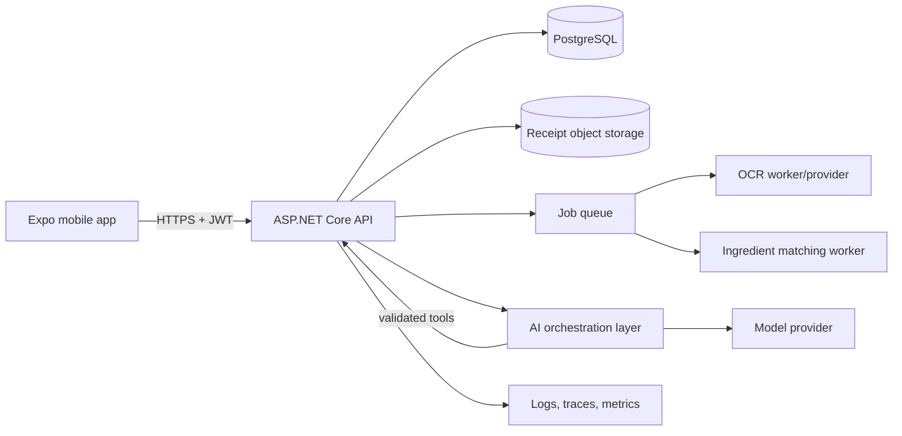

# Tech stack and architecture

## Current implementation

| Layer | Technology | Role |
|---|---|---|
| Mobile | React Native, Expo, Expo Router, TypeScript | Five-tab prototype for fridge, planner, recipes, shopping, and chat |
| API | ASP.NET Core controllers, C# `net10.0` | Validation, reads/writes, AI tool execution, Swagger, CORS |
| Data | EF Core, Npgsql, PostgreSQL 16 | Relational persistence, migrations, seed data |
| AI | OpenRouter chat completions and backend-defined tools | Reads and mutates application data through `ToolExecutor` |
| Local infrastructure | Docker Compose | PostgreSQL development service |

## Recommended target stack

| Concern | Recommendation |
|---|---|
| Mobile | React Native + Expo + TypeScript; TanStack Query for server state; a tested drag/drop library |
| Backend | ASP.NET Core 10 when stable/LTS-ready, C#, EF Core, FluentValidation, OpenAPI |
| Database | PostgreSQL with UUID keys for user-owned aggregates, constraints, indexes, and row-level security where appropriate |
| Authentication | OIDC provider with verified JWTs; household membership enforced in the API |
| Object storage | S3-compatible storage for receipt images with signed upload/download URLs |
| Jobs | Background worker plus durable queue for OCR, matching, notifications, and list regeneration |
| AI | Provider adapter, structured JSON output, backend tool allow-list, evaluation and audit metadata |
| OCR | Managed OCR/document service initially; preserve raw result and confidence for review |
| Cache | Add Redis only after measured need; do not make it a source of truth |
| Observability | OpenTelemetry traces/metrics/logs, error monitoring, correlation IDs |
| Delivery | Containers, CI checks, managed PostgreSQL, secrets manager, automated migrations with rollback plan |

## Target component flow

The backend remains the trust boundary. The mobile client and model may request
actions, but only authenticated application services validate and commit data.

## Why C# instead of a TypeScript backend

### Advantages

- Strong compile-time modelling for DTOs, enums, nullable fields, and domain
  services.
- Mature ASP.NET Core middleware, dependency injection, authentication,
  validation, OpenAPI, background services, and observability.
- EF Core provides migrations, transactions, concurrency patterns, and good
  PostgreSQL support.
- High performance and predictable server-side resource use.
- Clear separation from the React Native client can discourage accidental
  sharing of UI types as database contracts.
- Good fit for a backend responsible for verification, authorization, and
  transactional writes.

### Disadvantages

- The team maintains C# and TypeScript skill sets and cannot directly share
  runtime validation schemas.
- Preview framework/package versions can create compatibility and tooling risk;
  prefer stable versions for production.
- Mobile/API contracts require OpenAPI-generated clients or disciplined manual
  synchronization.
- Cold-start and deployment footprint may be larger than some minimal Node
  deployments, depending on hosting mode.
- AI SDK examples often appear in Python or TypeScript first, although HTTP and
  provider adapters make this manageable.

### Recommendation

Keep C# for the backend. It matches the requirement for authoritative
verification and data writes. Generate the TypeScript mobile client from the
backend OpenAPI contract and use stable .NET/EF/Npgsql versions before release.

## Backend module boundaries

- **Identity:** users, households, membership, authorization.
- **Inventory:** receipt import, ingredient matching, lots, expiry, quantity
  events.
- **Recipes:** recipes, normalized requirements, tags, dietary rules.
- **Planning:** AI proposals, accepted plans, prepared meals, reservations.
- **Shopping:** required amounts, stock subtraction, rounding, completion.
- **AI orchestration:** structured outputs, tools, prompt/model versions,
  evaluation, and audit trail.
- **Notifications:** expiry and weekly-plan reminders.

Start as a modular monolith. Split services only when scaling or ownership data
shows a concrete need.

