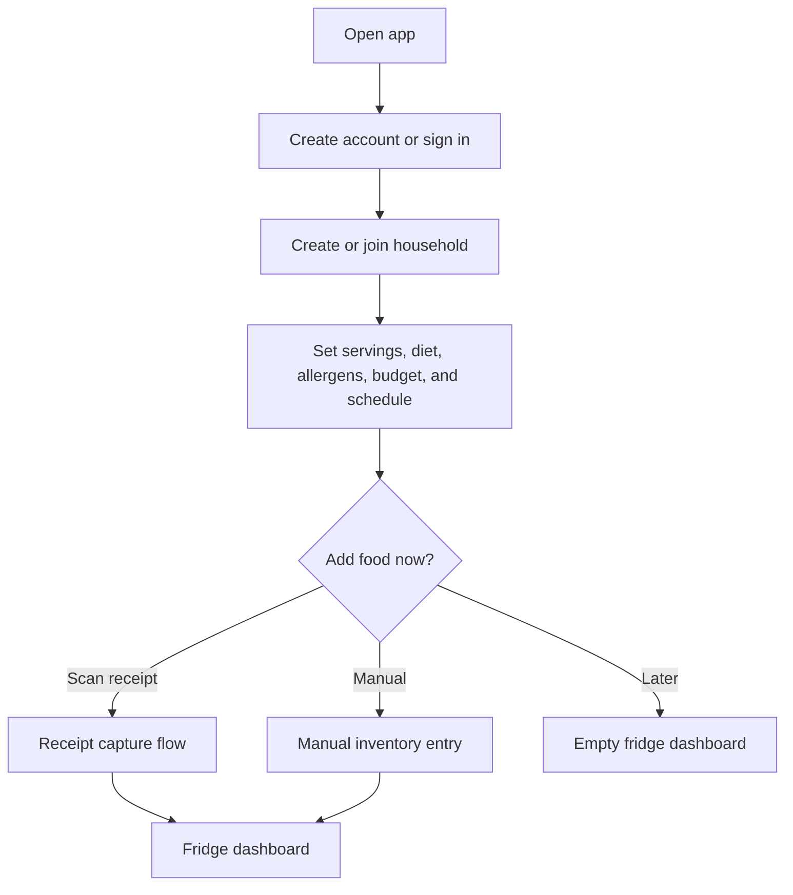
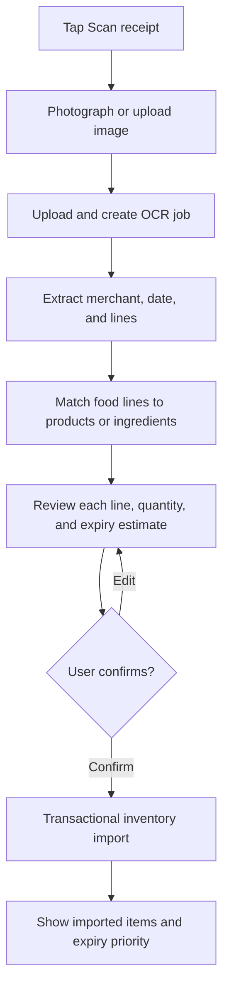
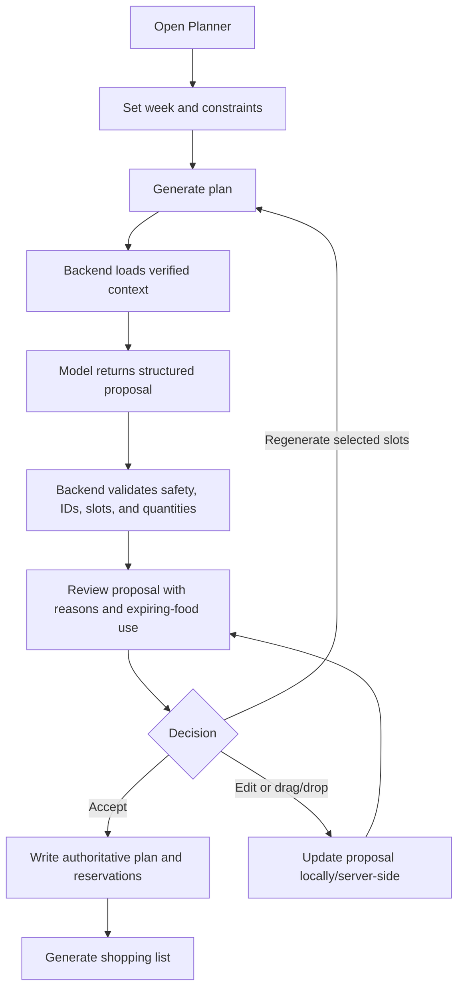
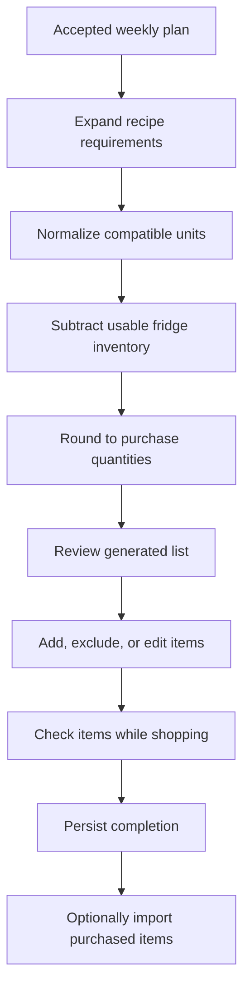

# User flows

## Navigation model

The prototype exposes Fridge, Planner, Recipes, Shopping, and Chat tabs. The
target product adds onboarding, receipt review, proposal review, and account
settings while keeping the five primary destinations.

## First-time setup

Allergen confirmation is a hard safety step. Optional preferences may be
skipped and completed later.

## Receipt capture and verification

Low-confidence matches must be visible. The system never treats OCR text as
authoritative before confirmation.

## Fridge and expiry flow

1. Open Fridge and view lots ordered by urgency.
2. Filter by storage location or category.
3. Open an item to correct quantity, unit, expiry type/date, or source.
4. Mark an amount used, discarded, or moved.
5. Request recipes that prioritize urgent ingredients.

The current prototype implements a simplified version: aggregate rows are
sorted by one best-before timestamp and “Use” subtracts one unit.

## AI weekly-plan flow

The current AI tool writes random recipe selections directly into `MealPlans`;
proposal review and acceptance are planned safeguards.

## Manual planning flow

1. Select a day and meal slot.
2. Browse recipes or prepared meal portions.
3. Review availability, expiry benefit, missing items, cooking time, and
   servings.
4. Drop or assign the meal to the slot.
5. Move it when the schedule changes; backend updates the authoritative entry.
6. Regenerate the shopping list after meaningful plan changes.

The current prototype uses tap-to-pick instead of drag/drop and supports recipe
slots only.

## Shopping flow

The current backend generates and stores a list, but the mobile checked state
is local-only and unit conversion is not used during subtraction.

## AI chat flow

1. User asks a fridge, expiry, recipe, plan, shopping, or stock-use question.
2. Backend sends the question and an allow-listed tool schema to the model.
3. The model requests a tool; the backend parses, authorizes, and validates it.
4. Read tools return verified data. Write tools run application services and
   transactions.
5. Backend returns a concise explanation of the result.

For sensitive or broad writes, require preview and confirmation. The current
chat is stateless and does not persist messages.

## Important failure paths

- OCR fails: keep the image/job, allow retry, and offer manual entry.
- Ingredient match is uncertain: require user selection or create a reviewed
  custom ingredient.
- AI output is invalid: reject it, log structured errors, and retry safely.
- Allergen conflict: block acceptance and explain the conflicting ingredient.
- Inventory changes after proposal: revalidate before acceptance.
- Network failure: retain unsent edits and use idempotency keys on retry.

